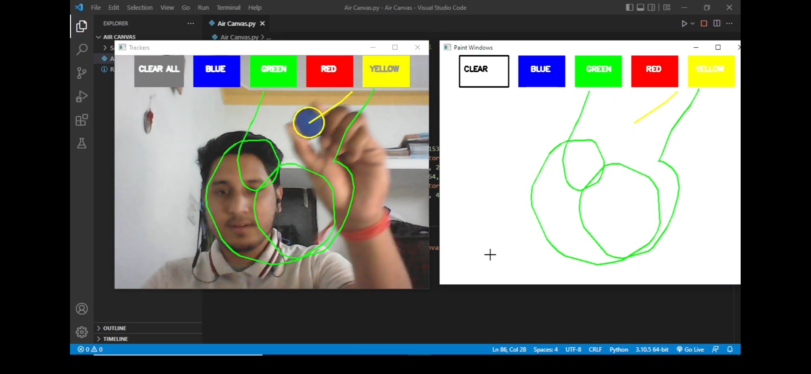

# **Air Canvas** using **Computer Vision** :art:

- __Air Canvas__ is a __virtual painting__ application that helps the user to draw on screen virtually just by waving their __finger__ fitted with __coloured caps__ in the air without touching the screen.
- This project uses the concept of __Computer Vision__ and is implemented using ```Python```, ```OpenCv``` & ```Numpy```.

# System Requirements:

- ```Python```
- ```OpenCv```
- ```Numpy```
- ```WebCam```

# Concepts used:

- __Color Tracking:__ Tracks the colored object at the finger tip.
- __Contour Detection:__ Detects the position of the colored object and making a circle over it.
- __Frame Processing:__ Tracking the finger tip and drawing points at each coordinate positions for virtual painting effect.
- __Image Masking:__ Image mask is created after detecting color.
- __Color space conversion:__ Converts the BGR into HSV values.

# Algorithm:
- Read the frames and convert the captured frames to HSV color space.
- Prepare the canvas frame and put the desired colors for painting.
- Prepare the mask and perform morphological operations on it.
- Detect the contours.
- Store the centre coordinates of the contour in the array for successive frames.
- Finally draw the points stored in the array on the screen.

# Screenshots:

## Initially, after running the python file the window will look like this:
- 

## After choosing the color you can start painting:
- 
# Applications of this project:
- Draw your imagination on screen easily.
- Can be used for teaching purpose and one can easily rub the window by just choosing clear all option.

Hope you all liked this project :heart:
